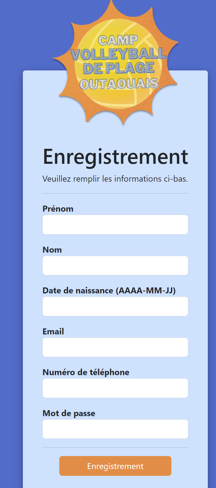
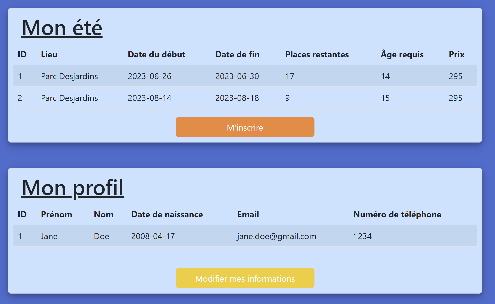
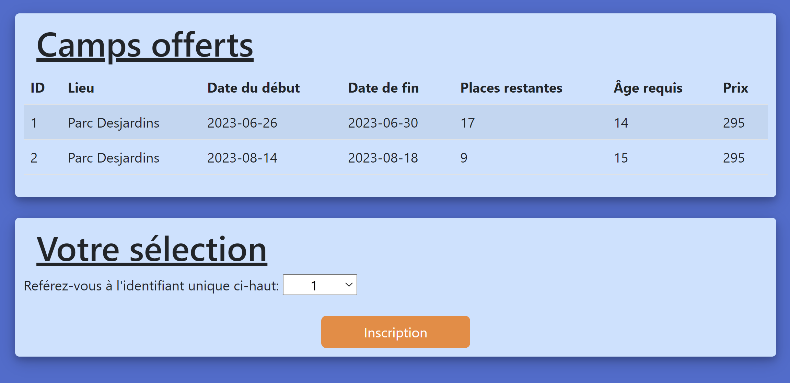
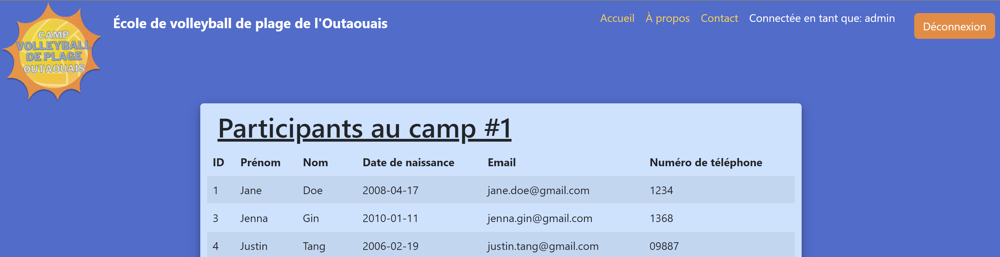

# Website: Volleyball Summer Camp

## Description
This App is a web application that was built using PHP, JavaScript, HTML, and CSS. The app uses MySQL as its database, and PHPMyAdmin to manage the database.

## Requirements
To run this app locally, you'll need to have the following software installed on your computer:

- PHP 7.2 or higher
- MySQL 5.7 or higher
- PHPMyAdmin

## Installation
- Clone this repository to your local machine.
- Import the database file `db/schema.sql` into your MySQL database and seed it `db/seed.sql` using PHPMyAdmin.
- Update the database connection details in `config/config.php` file with your MySQL credentials.

## Usage
- Open the terminal and navigate to the project directory.
- Start the PHP server by running the command `php -S localhost:8000`.
- Open your web browser and go to `http://localhost:8000/public/index.php`.
- You should see the login page.
- Log in with existing credentials (from seed) or register. Use username: `admin`, password: `admin` to access admin view, or username: `justin.tang@gmail.com`, password: `JustinTang` to access user view. This specific user is already registered to camp 1 from `seed.sql` but can be registered in camp 2!

-**Make sure to follow email format. If nothing happens when you press register, it is most likely because of input format**

## Demo
**I filmed a [demo](/docs/LISTENtoME.mp4) in case you have trouble running the code.**

## How it Works
The App has two views: one user and one admin. A user can create an account, see and update his profile information, see the camp(s) he's registered in, see available camps and register to them. The admin view simply reads the participants registered in each camp.

The app uses PHP to communicate with the MySQL database, and JavaScript to provide a better user experience. The HTML and CSS (bootstrap) are used to structure and style the app's interface.

## My App "Complexity"
To make sure I met the requirements, I implemented a few particularities. In the admin view, the tables are dynamically created, so I get from the table the number of offered camps and display this amount of tables and fill it in with the correct values.

Also, when displaying camps to users, I added a calculated attribute 'places_left' which is calculated from the camps[max_participants] minus the number of registered users.

## Next Steps
- Encode passwords
- Show message when input type/format is incorrect
- Show more camp details in dropdown menu of Register to Camp page
- Better database implementation

## Screenshots
**Log in pages** 

   

**User Home Page**
   

**User Camp Registration**
   

**Admin Home Page**

